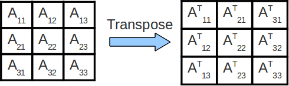

<!-- $theme: gaia -->


## Efficient computation with strided arrays in Julia:

# Strided.jl and TensorOperations.jl

#### Jutho Haegeman<br>Department of Physics & Astronomy<br>Ghent University

---

### Table of contents

* Multi-dimensional arrays in Julia
* Strided arrays
* Strided.jl
* TensorOperations.jl

---

### Multi-dimensional arrays in Julia

*	Natively supported: `AbstractArray{T,N}` where `T` is the type of elements and `N` the rank, the number of dimensions, indices, ... 

*	Powerful broadcasting, vectorized elementswise application of arbitrary functions using "dot" syntax, including fusion of dot operators:
	
	```julia
 	X = sin.([1 2 3; 4 5 6; 7 8 9]) .* exp.( [1 2 3].^2 )
  	```
*	Many ways to create: `Array{Float64}(undef,(10,10,10))`, `rand(10,10,10)`, `reshape(randn(10^3), (10,10,10))`, ...

---

### Multi-dimensional arrays in Julia

*	Many operations create a lazy view:
	```julia
    A = rand(ComplexF64, (100,100))
    B = reshape(A, (10, 10, 20, 5))
    C = view(B, (:, 1:8, 1:2:end, [4, 7, 8]))
    D = reshape(C, (10*8, :))
    using LinearAlgebra    
    E = transpose(A)
    F = adjoint(A) # or F = A'
    ```
    Here `B`, `C`, ..., `F` all share the same data with `A`.
    
---


### Multi-dimensional arrays in Julia

However:
*	`conj(A)` does create a new array, even though `transpose(A')` does not.
*	`permutedims(B,(4,3,2,1))` does create a new array (even though there is a lazy `PermuteDimsArray` in Julia Base)

---

### Multi-dimensional arrays in Julia

*	Broadcast implementation not optimized for data layout of transpose/adjoint array:
	```julia
    julia> using BenchmarkTools
    julia> A = randn(1000,1000);
    julia> @btime exp.(A); 
  	9.416 ms (4 allocations: 7.63 MiB)
    julia> @btime exp.(A');
  	13.440 ms (4 allocations: 7.63 MiB)
    ```
    
*	Broadcast implementation does not (yet) exploit multithreading.

--- 
### Strided arrays

* Julia uses one-based indexing 

* Julia's default array `Array{T,N}` uses column-major storage:
  `A[i₁,i₂,i₃,...]` with `size(A) = (d₁,d₂,d₃,...)` is located in memory at position $i_1 + (i_2-1)\cdot  s_2 + \ldots = 1+\sum_{k=1}^{N} (i_k - 1)\cdot s_k$
  with $s_1 = 1$, $s_i = s_{i-1}\cdot d_{i-1}$
  
* A strided array is one for which `A[i₁,i₂,i₃,...]` is located at memory position $o + \sum_{k=1}^{N} (i_k - 1)\cdot s_k$ for arbitrary $o$ and  $s_k$.

---

### Strided arrays
Several operations preserve stridedness:
* `permutedims` and `transpose`: just permute strides
* `view`: as long as only ranges and integers are used
* `reshape`: not always, depends on new sizes, cannot be determined at compile time

But simultaneously running over several arrays with different stride patterns requires some care if efficiency is important.

---

### Strided arrays

Fast array access:
-	spatial locality: use elements closeby in memory
-	temporal locality: re-use recent elements

E.g: `transpose` → competing order for spatial locality


---

### Strided arrays

Solution: use blocking strategy

```julia
julia> using BenchmarkTools, LinearAlgebra
julia> A = randn(1000,1000); B = similar(A);
julia> @btime adjoint!($B, $A);
  1.402 ms (0 allocations: 0 bytes)
julia> @btime $B .= $A';
  3.561 ms (1 allocation: 16 bytes)
```



---

### Strided arrays
Strided arrays in Julia:
* `StridedArray` is a `Union` type alias, i.e. it is a collection of `Array` and certain lazy array wrappers that are provably strided at compile time; it cannot be extended or subtyped
* Aside from specialized methods (`adjoint!`, `transpose!`), there are no smart strategies (i.e. blocking) for arrays with incompatible memory layout, e.g. in broadcasting
* Strided structure is not really used in `view` or `permutedims`.

---

### Strided.jl

Strided.jl in action: the `@strided` macro annotation

```julia
julia> using BenchmarkTools, LinearAlgebra, Strided

julia> A = randn(1000,1000); B = similar(A);

julia> @btime adjoint!($B, $A);
  1.398 ms (0 allocations: 0 bytes)

julia> @btime $B .= $A';
  3.316 ms (1 allocation: 16 bytes)

julia> @btime @strided $B .= $A';
  1.406 ms (9 allocations: 432 bytes)
```

---

### Strided.jl

Strided.jl in action: the `@strided` macro annotation

```julia
julia> using BenchmarkTools, LinearAlgebra, Strided

julia> A = randn(1000,1000); B = similar(A);

julia> @btime $B .= exp.($A);
  10.178 ms (0 allocations: 0 bytes)

julia> @btime $B .= exp.($A');
  14.625 ms (0 allocations: 0 bytes)

julia> @btime @strided $B .= exp.($A');
  12.419 ms (9 allocations: 432 bytes)
```

---

### Strided.jl

Strided.jl in action: the `@strided` macro annotation

```julia
julia> A = randn(4000,4000);

julia> B = similar(A);

julia> @btime $B .= ($A .+ $A') ./ 2;
  145.214 ms (0 allocations: 0 bytes)

julia> @btime @strided $B .= ($A .+ $A') ./ 2;
  56.189 ms (6 allocations: 352 bytes)
```

---

### Strided.jl

Strided.jl has blocking strategies for higher dimensional arrays ...
```julia
julia> A = randn(32,32,32,32);

julia> B = similar(A);

julia> @btime permutedims!($B, $A, (4,3,2,1));
  5.203 ms (2 allocations: 128 bytes)

julia> @btime @strided permutedims!($B, $A, (4,3,2,1));
  2.201 ms (4 allocations: 320 bytes)
```

---

### Strided.jl

... and treats `permutedims` lazily, e.g. in arbitrary broadcast expressions

```julia
julia> @btime $B .= permutedims($A, (1,2,3,4))
	.+ permutedims($A, (2,3,4,1))
	.+ permutedims($A, (3,4,1,2))
	.+ permutedims($A, (4,1,2,3));
  21.863 ms (32 allocations: 32.00 MiB)

julia> @btime @strided $B .= permutedims($A, (1,2,3,4))
	.+ permutedims($A, (2,3,4,1))
	.+ permutedims($A, (3,4,1,2))
	.+ permutedims($A, (4,1,2,3));
  8.495 ms (9 allocations: 640 bytes)
```

---

### Strided.jl

For simple arrays with linear data layout, there is not much to speed up ...

```julia
julia> A = randn(1000,1000);

julia> B = similar(A);

julia> @btime $B .= $A .* exp.( -2 .* $A) .+
					sin.( $A .* $A);
  19.974 ms (0 allocations: 0 bytes)

julia> @btime @strided $B .= $A .* exp.( -2 .* $A) .+
					sin.( $A .* $A);
  20.742 ms (11 allocations: 512 bytes)
```

---

### Strided.jl

... unless you enable multithreading (i.e. run `julia` with `export JULIA_NUM_THREADS = 4`):

```julia
julia> A = randn(1000,1000);

julia> B = similar(A);

julia> @btime $B .= $A .* exp.( -2 .* $A) .+
					sin.( $A .* $A);
  20.038 ms (0 allocations: 0 bytes)

julia> @btime @strided $B .= $A .* exp.( -2 .* $A) .+
					sin.( $A .* $A);
  5.814 ms (91 allocations: 3.53 KiB)
```


---

### Strided.jl

... unless you enable multithreading (i.e. run `julia` with `export JULIA_NUM_THREADS = 4`):

```julia
julia> using BenchmarkTools, LinearAlgebra, Strided

julia> A = randn(1000,1000); B = similar(A);

julia> @btime adjoint!($B, $A);
  1.230 ms (0 allocations: 0 bytes)

julia> @btime $B .= $A';
  3.035 ms (1 allocation: 16 bytes)

julia> @btime @strided $B .= $A';
  834.105 μs (82 allocations: 2.95 KiB)
```

---

### Strided.jl: implementation

Strided.jl provides a `StridedView` type that represents the most general (possibly conjugated) strided view over some linear data (i.e. `DenseArray`). 

```julia
struct StridedView{T,N,A<:DenseArray,F}
  parent::A
  size::NTuple{N,Int}
  strides::NTuple{N,Int}
  offset::Int
  op::F
end
```

---

### Strided.jl: implementation


`StridedView` is closed under:
* 	views with ranges (`@views` not necessary)
* 	`permutedims`
* 	`conj`, `transpose` and `adjoint`
* 	certain reshapes using `sreshape`
	(checked at runtime)
    
---

### Strided.jl: implementation

Strided.jl overloads broadcasting (and related operations, e.g. `map`, `mapreduce`) with specialized implementations for `StridedView`.

There is one very general function that combines broadcasting and reductions, and takes care of

* dividing the task into subtasks for the different threads
* further divide subtasks into blocks of appropriate size (i.e. cache)
* find optimal loop order

---

### Strided.jl: implementation

* A cost model is used to estimate the importance of each dimension, based on the different strides of the participating arrays along that dimension, inspired by
["HPTT: A High-Performance Tensor Transposition C++ Library", Paul Springer (2017)](http://doi.acm.org/10.1145/3091966.3091968)

* Metaprogramming is used (`@generated` function) to generate a set of outer loops over the different blocks, and then a set of inner loops over elements of a single block

---

### TensorOperations.jl

*Efficient tensor (=  multidimensional arrays) manipulations using a convenient syntax*

1.	What are tensor operations?
2.	How to specify tensor operations (permutations, tensor contractions) ? 
3.	How to implement the primitive operations efficiently?

---

### TensorOperations.jl

1.	What are tensor operations?

*	Permutations: 	$C_{i,j,k} = A_{k,j,i}$
*	Tracing indices: $C_{i,j} = \sum_{k,l} A_{i,k,l,j,l,k}$
*	Contracting indices:
	$C_{i,j,k} = \sum_{l,m} A_{m,j,i,l} \cdot B_{l,k,m}$

In fact, these are implemented more generally as
$$ C = \beta \cdot C + \alpha \cdot \mathrm{tensoroperation}(A[,B])$$ 

---

### TensorOperations.jl

2.	How to specify them efficiently:

Einstein summation convention: every index that appears twice is traced/contracted:
$C_{i,j,k} = \alpha	\cdot	A_{m,j,i,l} \cdot B_{l,k,m}$

or in Julia syntax

```julia
@tensor C[i,j,k] = α * A[m,j,i,l] * B[l,k,m]
```
where indices can just be arbitrary names. (E.g. compare with `numpy.einsum`)

---

### TensorOperations.jl

2.	How to specify them efficiently:

Alternatively: graphical representation


---


### TensorOperations.jl

2.	How to specify them efficiently:


---

### TensorOperations.jl

3.	How to implement them efficiently:

*	A trace is like a reduction (i.e. summing over diagonal indices). Permutations, additions and tensor traces are handled by Strided.jl
*	Tensor contractions:
	*	generalization of matrix multiplication
	*	can be performed as matrix multiplication,
up to additional permutations and reshapes
(which require additional temporaries to be allocated)

---

### TensorOperations.jl

3.	How to implement them efficiently:

*	Contracting multiple tensor: no fusing; pairwise contractions are most efficient (despite the additional temporaries)

*	What is the optimal order of pairwise contractions?

*	What is the overhead of all the temporaries?

---

### TensorOperations.jl

An example:
```julia
using TensorOperations
α=randn(); A=randn(5,5,5,5,5,5); B=randn(5,5,5)
C=randn(5,5,5); D=zeros(5,5,5)
@tensor begin
    D[a,b,c] = A[a,e,f,c,f,g]*B[g,b,e] + α*C[c,a,b]
    E[a,b,c] := A[a,e,f,c,f,g]*B[g,b,e] + α*C[c,a,b]
end
```
Equivalently:
```julia
@tensor D[å'',ß,c'] = A[å'',1,-3,c',-3,2]*B[2,ß,1] + 
			α*C[c',å'',ß]
```

---

### TensorOperations.jl

Real-life example:
```julia
@tensor HrA12′[a, s1, s2, c] :=
	rhoL[a, a'] * A1[a', t1, b] * A2[b, t2, c'] *
	rhoR[c', c] * H[s1, s2, t1, t2]
```
The `@tensor` macro will recognize primitive tensor operations, and transform this into an equivalent sequence of function calls.
By default, tensors are contracted from left to right:
```julia
@tensor HrA12′[a, s1, s2, c] :=
	((((rhoL[a, a'] * A1[a', t1, b]) * A2[b, t2, c'])
    	* rhoR[c', c]) * H[s1, s2, t1, t2])
```

---

### TensorOperations.jl

TensorOperations.jl (since v1.0) also has a global cache dictionary, where it keeps all the most recent temporaries (using a configurable amount/fraction of the total memory), so that they can be re-used.

---

### TensorOperations.jl

```julia
@tensoropt (a,b,c,b',c') HrA12′[a, s1, s2, c] :=
	rhoL[a, a'] * A1[a', t1, b] * A2[b, t2, c'] *
	rhoR[c', c] * H[s1, s2, t1, t2]
```
The `@tensoropt` macro will analyze the contraction pattern, compute an optimal order (at compile time) and reorganise the order so as to use the most optimal (theoretical) order.

1.  Finding optimal cost scales exponentially in number of tensors (is an NP-complete model), but this does not seem to be a practical problem.

2.	Better cost models are probably needed.

---

### Outlook

For Strided.jl:
* GPU support!
* An index notation syntax for general broadcast + reductions

For TensorOperations.jl:
* Support for machine learning applications, computation graphs, automatic differentiation
* Other/better ways to optimize contraction order (different cost model)